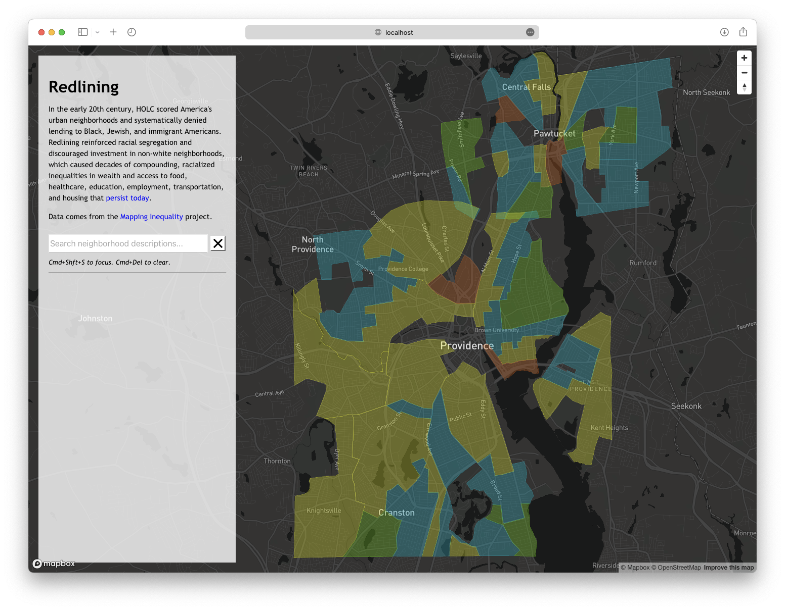
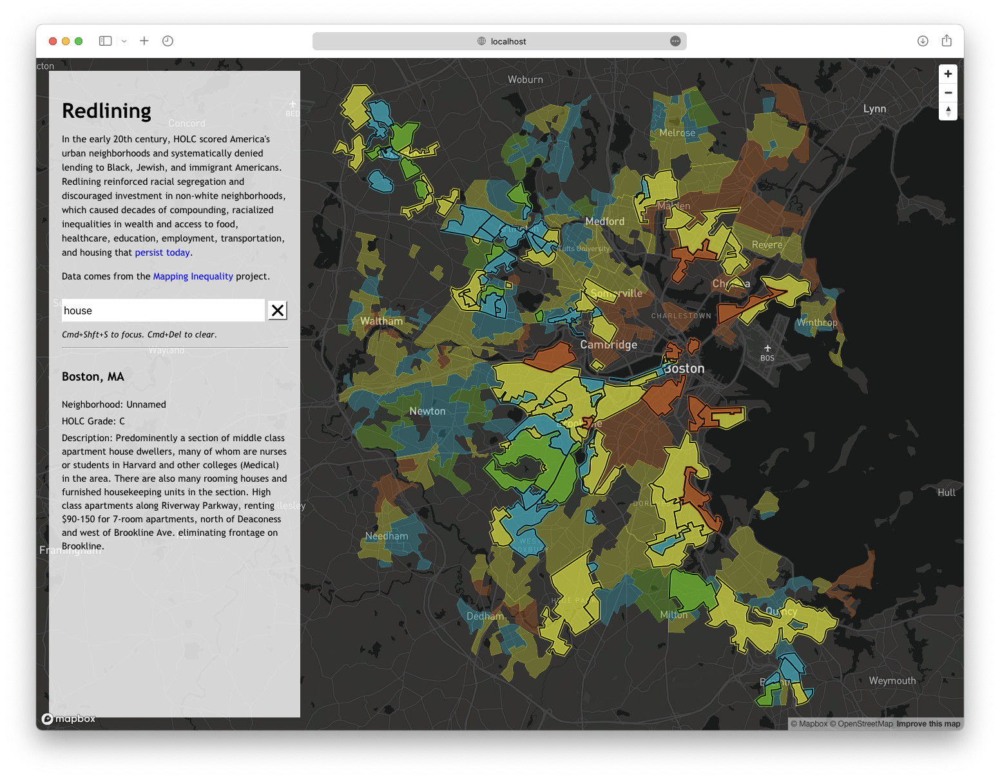

# Visualizing Redlining

This is a full-stack web app that uses MapBox GL to visualize and search redlining maps produced by the Home Owner's Loan Corporation (HOLC). In the early 20th century, HOLC scored America's urban neighborhoods and systematically denied lending to Black, Jewish, and immigrant Americans. Redlining reinforced the degree and physical scale of racial segregation and discouraged investment in non-white neighborhoods, which caused decades of compounding, racialized inequalities in wealth and access to food, healthcare, education, employment, transportation, and housing that [persist today](https://www.bostonglobe.com/2022/03/10/metro/redlining-never-really-went-away-black-rhode-islanders-still-face-racism-when-buying-home/). In the map of Providence below, notice how I-95, I-195, and RI-146 were built through and demolished three out of four redlined neighborhoods including [Cape Verdean Fox Point](https://www.providencejournal.com/in-depth/news/2022/08/11/fox-point-providence-ri-route-195-displacement-history-construction/10148225002/), [historically Black Hardscrabble](http://smallstatebighistory.com/camp-hill-hardscrabble-and-addisons-hollow-in-early-providence/), and Pawtucket's School Street.

This project was developed by [Michael Kearney](https://github.com/michaelandrewkearney) and [Lizzy Zhang](https://github.com/ezhangy) for a software development class taught by [Tim Nelson](https://cs.brown.edu/~tbn/) at Brown University in Spring 2023.

## Preview
View digitized redlining maps and grades assigned by HOLC to neighborhoods. Green neighborhoods received an "A", blue ones a "B", yellow ones a "C", and red ones a "D".

Search neighborhoods and click on neighborhoods to read HOLC's description.


## How to use this program
1. Create a [MapBox Access Token](https://docs.mapbox.com/help/getting-started/access-tokens/).
2. Store your token by running
   ```
   echo 'export const ACCESS_TOKEN: string = "[YOUR TOKEN]"' > frontend/src/private/keys.ts
   ```
3. Run [Server.java](backend/src/main/java/edu/brown/cs32/ezhang29mkearne1/server/Server.java) in 'backend'.
4. Run `npm run dev` to launch the frontend.
5. In your local browser, navigate to the localhost URL provided by Vite.

## Architecture Notes
This project consists of a React and Typescript frontend wrapping MapBox GL served by a Java Spark backend. We [modeled the GeoJSON spec](backend/src/main/java/edu/brown/cs32/ezhang29mkearne1/geoData/GeoJSON.java) in Java and used Moshi's polymorphic factories to serialize and parse the spatial data. A searcher handles requests from the frontend and caches text and bounding-box queries.

## Citations
- The redlining map data is from the [Mapping Inequality](https://dsl.richmond.edu/panorama/redlining) project at the University of Richmond.
- GeoJSON modeling used the spec from the [IETF](https://datatracker.ietf.org/doc/html/rfc7946).
- This project uses [Mapbox GL](https://docs.mapbox.com/mapbox-gl-js/guides).
- Serialization relies on [Moshi](https://github.com/square/moshi).
- The frontend server runs on [Vite](https://github.com/vitejs/vite).
- An <a href="https://www.svgrepo.com/svg/12848/x-symbol">SVG icon</a> was made by someone at SVGRepo.
